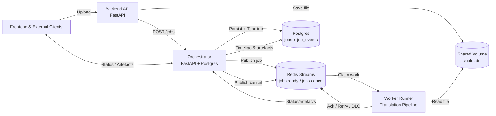

# Orchestrator and Worker Architecture

## 1. High-Level Summary
- **Frontend / Clients**: Upload Lao documents, poll job status, fetch artefacts, or cancel work through the backend API facade.
- **Backend API**: Accepts uploads, stores files on the shared volume, and forwards orchestration commands using the shared JobStatus contract.
- **Orchestrator**: FastAPI service backed by Postgres + Alembic migrations. Persists job metadata and timeline events, exposes `/jobs` REST endpoints, and publishes work items to Redis Streams.
- **Worker**: Long-running runner that consumes Redis Streams, executes the translation pipeline, pushes status updates (with retry/backoff) to the orchestrator, and deposits artefacts.
- **Shared Services**: Redis provides durable queuing semantics; Postgres stores job state and timeline; the shared upload volume exposes source files and generated artefacts to both backend and worker containers.

## 2. Component Responsibilities
### Orchestrator
- Validate incoming jobs, persist metadata, and append timeline events for every state change.
- Publish work items to `jobs.ready`, listen for cancellation via `jobs.cancel`, and expose artefact download endpoints.
- Run Alembic migrations automatically on startup, stamping the schema if legacy tables exist without a version record.

### Worker
- Consume messages from Redis Streams using consumer groups, auto-claim stale deliveries, and honour exponential backoff + max retry limits.
- Emit human-readable status summaries (derived from the shared contract) so the orchestrator timeline is rich enough for the UI.
- Upload artefacts (text, generated PDFs, previews) or push inline metadata back via `/jobs/status`.

### Backend API
- Provide the legacy `/upload`, `/api/status/{task_id}`, and `/api/result/{task_id}` endpoints as a facade over the orchestrator REST API.
- Save uploaded documents to the shared volume used by workers and hand off orchestration requests.

## 3. End-to-End Flow (Mermaid)

## 4. API and Messaging Contracts
| Direction | Interface | Path / Channel | Payload Highlights | Purpose |
| --------- | --------- | -------------- | ------------------ | ------- |
| Client -> Backend -> Orchestrator | HTTP REST | `POST /jobs` | upload metadata, options, auth | Create job, receive `job_id` |
| Client -> Orchestrator | HTTP REST | `GET /jobs/{id}` | none | Latest status with timeline |
| Client -> Orchestrator | HTTP REST | `GET /jobs/{id}/timeline` | ordered status events | Power progress UI |
| Client -> Orchestrator | HTTP REST | `GET /jobs/{id}/result` | `format` query | Retrieve final artefacts |
| Client -> Orchestrator | HTTP REST | `GET /jobs/{id}/artefacts/{name}` | streamed/inline artefact | Download or preview stored artefacts |
| Client -> Orchestrator | HTTP REST | `POST /jobs/{id}/cancel` | optional reason | Request cancellation |
| Orchestrator -> Queue | Redis Stream | `jobs.ready` | job descriptor, attempt counter | Notify workers of executable work |
| Orchestrator -> Queue | Redis Stream | `jobs.cancel` | job id, cancel token | Broadcast cancellation |
| Worker -> Orchestrator | HTTP REST | `/jobs/status` | status enum, detail, artefacts | Update timeline + artefacts |

> **Note**: Worker-to-orchestrator callbacks can be REST (current implementation), gRPC, or message-based, as long as they update the single source of truth inside Postgres.

## 5. Timeline Behaviour
1. Client uploads through the backend facade; backend stores the file and calls `POST /jobs`.
2. Orchestrator persists the job (`jobs` table), logs an initial `PENDING` event (`job_events` table), and publishes the payload to `jobs.ready`.
3. A worker claims the stream entry, reads the file from the shared volume, and runs the translation pipeline. Each stage calls the status callback, yielding timeline entries such as `IMAGE_CONVERSION`, `OCR_PROCESSING`, etc.
4. Successful completion posts artefact metadata (text + previews) and marks the job `COMPLETE`; failures requeue with backoff or ultimately dead-letter.
5. Clients poll `GET /jobs/{id}` or `GET /jobs/{id}/timeline` for progress, then fetch artefacts via `GET /jobs/{id}/result` or the targeted artefact endpoint.
6. Cancellation (`POST /jobs/{id}/cancel`) updates the job, appends a timeline entry, and publishes to `jobs.cancel`; workers honour cancellation before acknowledging.

## 6. Shared Translation Engine Package
- Location: `backend/app/engine/`
- Key modules reuse the shared `JobStatus` enum exported from `backend/app/shared/status.py`, ensuring consistent contracts across backend, orchestrator, and worker.
- `pipeline.py` orchestrates ingestion, OCR, translation, and export steps while emitting callback events consumed by the worker.

## 7. Queue & Persistence Details
- **Redis Streams**: Consumer group (`jobs-workers`) with configurable visibility timeout (`JOB_QUEUE_ACK_TIMEOUT_MS`), retry/backoff knobs (`JOB_QUEUE_MAX_RETRIES`, `JOB_QUEUE_BACKOFF_*`), and DLQ routing (`jobs.dead`). Misconfiguration of `REDIS_URL` fails fast rather than silently falling back.
- **Postgres / Alembic**: Startup runs Alembic migrations; if tables already exist (legacy deployments) a stamp operation seeds the version table before `upgrade` runs.
- **Artefact Storage**: Shared `/backend/uploads` volume gives backend and worker consistent access to source files and generated outputs. Future work includes moving large artefacts to object storage.

## 8. Documentation & Operations
- Queue configuration, retry policy, and failure modes are captured in the runbook (`docs/README.md`).
- Alembic migrations ensure schema consistency across environments; run `docker compose build orchestrator` after schema-affecting changes.
- Observability hooks (structured logging for ack/retry/dead-letter) feed into future metrics dashboards for pending/dead-letter counts.

